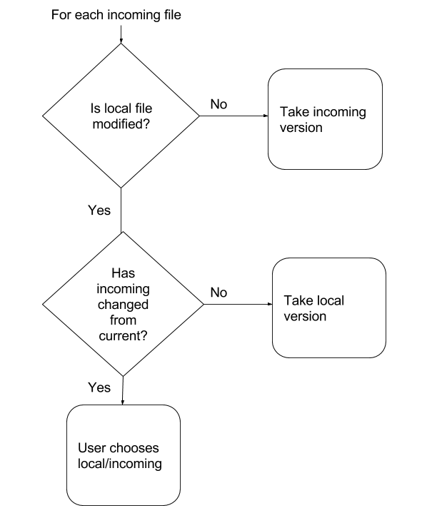

### What is GetPack?

GetPack makes it easier to share, reuse and update Unity plugins.

<iframe width="560" height="315" src="https://www.youtube.com/embed/gw4GXONRhXI" frameborder="0" allowfullscreen></iframe>
&nbsp;

### Take control of your plugins

State **what** packages your project needs in the **project manifest:**

```json
{
    "dependencies" : [
        "darktable:minijson:1.0.0",
        "google:android-support:23.0.0",
        "facebook:unity-sdk:4.2.0"
    ]
}
```

GetPack takes care of **installing**, **removing** and **upgrading** packages for you; simply state what you want in your project manifest and run GetPack's `gpSync` task.

What's more, GetPack's upgrade process can help you preserve local changes, and lets package authors move and rename files when publishing new versions.

### Dependency management

Unity developers use plugins to reuse great work and avoid reinventing the wheel,
but it's much harder for plugin makers to do the same.

Unity plugins are forced to bundle dependencies, causing plugins to conflict with each other
and <a href="https://www.google.com/webhp?sourceid=chrome-instant&ion=1&espv=2&ie=UTF-8#q=android+support+library+conflict+unity">much pain for everyone</a>.

GetPack uses [Gradle's dependency management](https://docs.gradle.org/current/userguide/dependency_management.html) so plugins can declare dependencies instead of bundling them.

### Unobtrusive

GetPack supports any existing plugin directory structure including multiple root folders, and uses the `.unitypackage` format for packaging Assets, so Asset GUIDs and metadata are preserved.

___

# Requirements

* Windows/OSX
* [JRE/JDK](http://www.oracle.com/technetwork/java/javase/downloads/jre8-downloads-2133155.html)
* [Gradle 3+ **(Gradle < 3 not supported)**](https://gradle.org/gradle-download)

Follow [Gradle's installation instructions](https://docs.gradle.org/current/userguide/installation.html) ensuring that it is added to your path; check that running `gradle` from the command prompt succeeds.

<div class="note unreleased">
  <h5>Work in progress</h5>
  <p>An installer will automate installing GetPack and its dependencies.</p>
</div>

# Getting started

<div class="note warning">
  <h5>Back up your project!</h5>
  <p>You are strongly advised to use an SCM tool like Git or SVN when using GetPack.</p>
</div>

## Applying the plugin

GetPack is implemented as a plugin for the Gradle build system.

1. Create a text file called `build.gradle` next to your project's Assets folder.
2. Paste the following into it:

```groovy
plugins {
    id 'com.banderous.getpack' version '0.2.0'
}
```

<ol start="3">
  <li>Run <code>gradle tasks</code> at a command prompt in your project folder to see the key tasks GetPack offers and create a default project manifest.</li>
</ol>


```shell
gradle tasks
```
___

## The project manifest

You install, remove and up/downgrade packages just by editing your manifest and **synchronising**.


The project manifest is found at `getpack/project.json`.

<div class="note info">
  <h5>You can copy this sample</h5>
  <p>Try pasting it into your own project manifest and running <code>gpSync</code>.</p>
</div>

```json-doc
{
    "repositories" : ["https://raw.githubusercontent.com/banderous/getpack-sandbox/zip/build/repo"],
    "dependencies" : [
        "darktable:minijson:1.0.0",
        "google:android-support:23.0.0"
    ]
}
```

<dl>
  <dt>repositories</dt>
  <dd>A list of one or more package repositories where GetPack should retrieve packages.</dd>
  <dt>dependencies</dt>
  <dd>A list of package identifiers that this project depends on.</dd>
</dl>

**Package identifiers** are made up of the publisher, the name of the package and a version, colon delimited.

___

## Synchronisation

Packages are installed, uninstalled and upgraded with a single task; `gpSync`, which **synchronises** the packages installed to match those declared in the project manifest.

`gpSync` detects any changes made to the project manifest since the last execution of `gpSync`, such as new, removed or changed packages, and performs any necessary installs, uninstalls or upgrades.

```shell
gradle gpSync
```

<div class="note info">
  <p>All GetPack tasks automatically find and launch the correct version of the Unity Editor for your project if it isn't already open.</p>
</div>

### Uninstallation

GetPack uninstalls a package if it is removed from the project manifest (and not a transient dependency of another package).

The uninstallation process removes a package's files from the project *except files that have been modified*.

---

### Upgrades

GetPack upgrades a package when its version number in the project manifest has changed since the last `gpSync`.

The upgrade process allows users to keep local changes if desired and allows package authors to rename and move files when publishing new versions.

GetPack performs a three-way comparison between the **current** version installed in the project,
the **incoming** version to be installed, and the **local** files as they currently exist in the project.

<p align="center">

</p>

---

### The shadow manifest

In order to detect changes to the project manifest, GetPack maintains another JSON file called the **shadow manifest**, at `getpack/project.json.state`.

GetPack updates the shadow manifest automatically during the synchronisation process and it should not be manually edited.

<div class="note warning">
  <h5>The shadow config should be versioned alongside your project</h5>
  <p>(If you version your dependencies in your SCM)</p>
</div>

## Creating packages

Packages are declared in the **publisher configuration** at `getpack/publish.json`.

You can generate a template package configuration with the `gpCreatePackage` task:

```shell
gradle gpCreatePackage
```

This will create a new package configuration to be set up as follows:

```json-doc
{
  // Where to publish your packages.
  // Gradle supports many locations Eg. Amazon S3, HTTP, FTP.
  "repositories": ["s3://amazonaws.com/..."],
  // You can declare multiple packages in a single project.
  "packages": [
    {
      "id": "acme:example:1.0.0",
      // Declare the path(s) to be published in this project relative to Assets/
      "roots": [
        "Plugins/Example/**"
      ],
      // Any dependencies required by this package are declared here.
      "dependencies": ["com.foo:anotherplugin:1.0.0"]
    }
  ]
}
```

If you then run `gradle tasks` you will see new publishing related tasks for your package:

GetPack creates a new task for each package called publish[Publisher][Name], so you can publish individually

```shell
gradle publishAcmeExample
```

Or all packages in a project can be published in a single command:

```shell
gradle publish
```
---

## Package format

GetPack publishes packages in the [Apache Ivy](http://ant.apache.org/ivy/history/latest-milestone/terminology.html) format, and a package consists of two main files.

<dl>
  <dt>A .unitypackage file</dt>
  <dd>This contains all Assets and metadata in the normal Unity format.</dd>
  <dt>A .manifest file</dt>
  <dd>This is a JSON file describing the Assets in the package; their GUIDs, paths and file hashes, used by GetPack when uninstalling and upgrading packages.</dd>
</dl>
